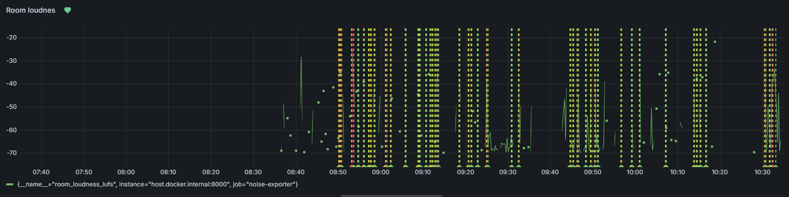

# 🎧 Room Sound Monitoring System

A real-time sound monitoring system that captures audio from a room, converts it into loudness metrics, and visualizes the data using Prometheus and Grafana. It also triggers alerts when noise levels exceed defined thresholds.

---

## 🚀 Goal

- Measure sound levels in real-time
- Convert audio into LUFS loudness metrics
- Store metrics as time-series data
- Visualize data in Grafana
- Trigger alerts for loud environments

---

## 🧰 Tech Stack

- Python (audio processing)
- sounddevice / pyloudnorm
- Prometheus
- Grafana
- Alertmanager

---

## 🏗️ Architecture

Microphone → Python Script → Prometheus → Grafana → Alerts

---

## ⚙️ Setup

Install dependencies:

```bash
pip install -r requirements.txt
```
---

## 🚨 Alerts

Alerts are triggered when sound exceeds defined thresholds or when noise is sustained over a period of time.

Notifications can be sent via:
- Email
- Slack
- Telegram (optional)

---
## 📈 Grafana Dashboard

The dashboard visualizes real-time sound levels and historical noise trends from the monitored room.

